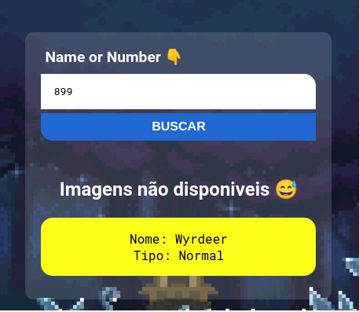

<!-- titulo -->
# **Pokedexr**
<!-- qual exercicio ? -->
> ## 🚀Projeto com API
---
<a href="https://github.com/IsaacGSS/Pokedex#readme">***🚢 README***</a>

</br>

<!-- Descrição do exercisio proposto pelo professor -->
**📄 Descrição | Proposta** </br>
Um projeto no qual sera utilizado uma <a href="https://pokeapi.co/?ref=public-apis" >API</a> para buscar informacao direto da mesma e nos retornado na tela, como imagens, nome, tipo do pokemon, foi desidico ser realizado esse projeto para treinar e aprender como inplementrar API aos projetos e demais.

---
<!-- tecnologia utilizada -->
### 🧑‍💻**Tecnologia**
> * **JS**
> * **CSS**
>  * **HTML**
---

<!-- aqui iremos mostrar como foi resolvido -->
## **Resolvendo..**
> ### <a href="https://github.com/IsaacGSS"> ***@Isaac S. Silva***</a>
---
<!-- resumo e/ou descrição da comclusão -->
<q>Assisti ao um video mostrando como se implementava a PokeAPI, logo em seguida construi esse projetos com poucas diferencias divuais e no codigo, porem fui eu mesmo que costrui ela, logo mais penso em doficiaar ela, ento no layout, o codo em si e ate mesnmo utlilizando outra tecnologia</q>

<a href="https://youtu.be/vdytGGKyJKE">**Video citado**</a>

</br>

<!-- topicos da resoluçãao -->
* O Basico
```js
  //  [ function ]
form.addEventListener('submit', function(e){

  //  Desliga o refresh do input
  e.preventDefault();

  // codigo..
});
//------------------{And also}-----------------------

//  elementos em variaveis
  let form = document.querySelector('form');
  let nome = document.querySelector('#pokeinput');
  let content = document.querySelector('#pokeinformation');
  let contentimg = document.querySelector('#pokeimg');

//  Link da API
  let url = "https://pokeapi.co/api/v2/pokemon/";

//  concatenação entre a api e ao input
  let valorName = this.pokeinput.value.toLocaleLowerCase();
  url = url + valorName

//  Resposta em HTMl [esperando codigo para retornar]
  let html = ''
``` 

* Codigo, Logica e API
```js
//  Puxando API, aplicando API
  fetch(url)
    .then(content => content.json())
    .then(function(data) {
      //  [1] code
    })
    .catch(function(err){
      //  [2] code
    })
//---------------------------------------------------------

//  [1] codigo para processar e retorno
  // Montando -> Return de dados {name e type}
  html = `<p>Nome: ${data.name} 
              </br> 
              Tipo: ${data.types[0].type.name}</p>
      `
      // Return de dados {name e type}*
      content.innerHTML = html

  // Montando -> Return das imagens
  html = ` 
          
          `

      // Return de imagens
      contentimg.innerHTML = html

      // Reset np valor do input
      nome.value = ''

//---------------------------------------------------------

//  [2] codigo de erro 
  // Retorno de erro
  content.innerHTML  = `<p>Ops😅, Pokemon "<u>${valorName.toLocaleUpperCase()}</u>" nao encontrado </br> tente outra vez</p>`

    // Reset de Imagens
    contentimg.innerHTML = ''
```
* Error de img na API
  Em casos da API não dar suporte com as imagens, uma mensagem de erro ira retornar

```js
 if ( imgFornt === null || imgBack === null ) {

  html = '<h2>Imagens não disponiveis 😅</h2>'

  contentimg.innerHTML = html
} else {

  html = `

        `
  contentimg.innerHTML = html
}
```