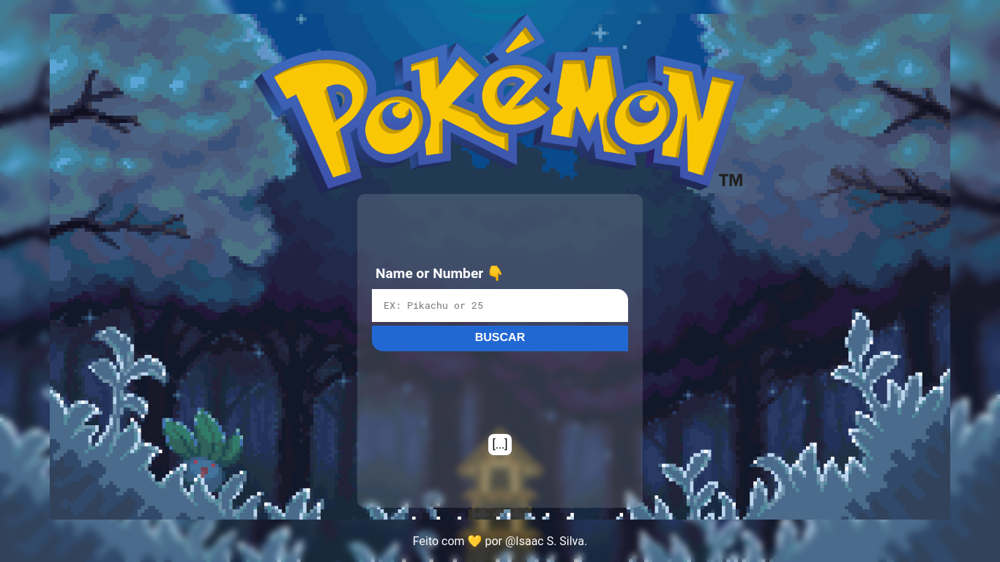

# **🤓 Pokedex**
 Projeto utilizando API do Pokemon com Javascript
## 📜 Status
> Status: Finalized
> 
> <a href="">👌 Pokedex.md</a>

## 👨‍💻 Technology
> 
> 
> 

## 💻 Funcionalidades

> * Em um input digite o nome ou o numero do pokemon corespondente desejado
> * O Site ira buscar em uma API os dados e ira retornar na tela

## 👀 Preview
 
<!-- >  -->
> 